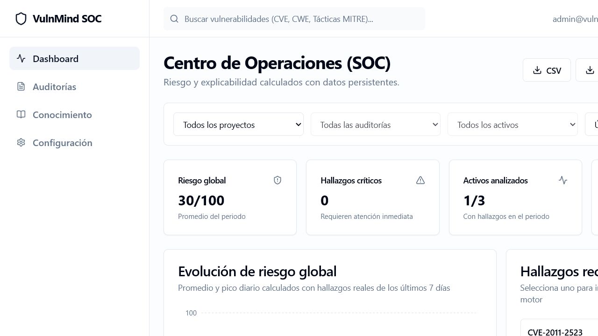
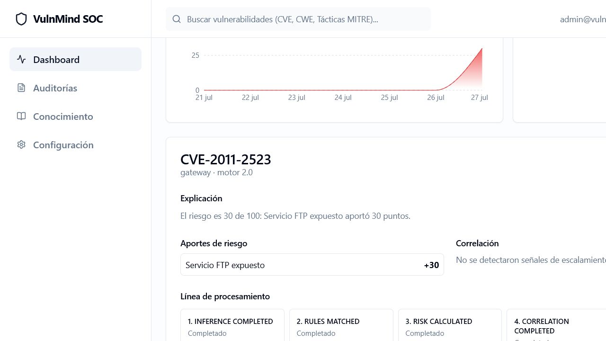
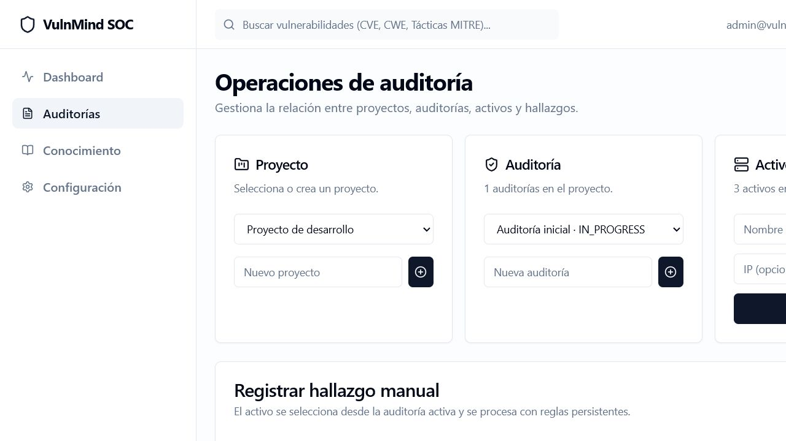
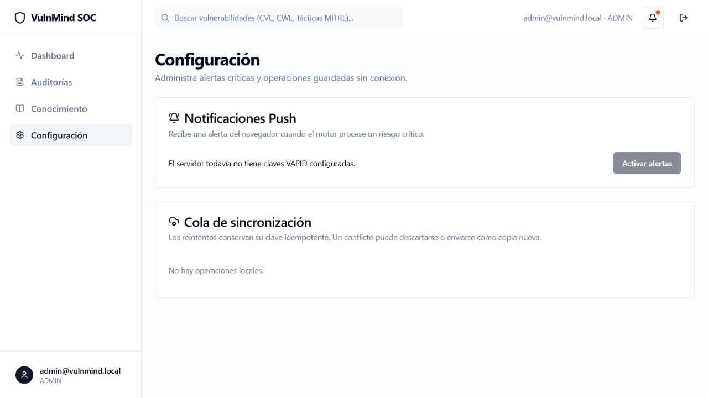
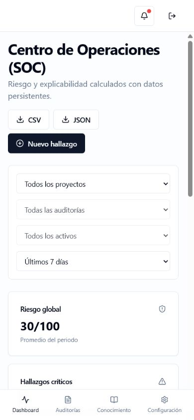

# VulnMind

VulnMind es una PWA para auditorías de ciberseguridad. Gestiona proyectos,
auditorías y activos; procesa hallazgos con reglas persistentes; calcula riesgo,
correlación y recomendaciones; y conserva una explicación completa de cada
decisión.

## Funcionalidad

- Autenticación JWT y roles `ADMIN`, `AUDITOR` y `VIEWER`.
- CRUD operativo y base de conocimiento en PostgreSQL.
- Motor idempotente y explicable con historial, MITRE, OWASP y CWE.
- Importación Nmap XML, CSV y JSON con errores por registro.
- Borradores y cola offline en IndexedDB con reintentos y conflictos.
- Notificaciones Web Push para hallazgos críticos.
- Dashboard real con filtros de proyecto, auditoría, activo y 7/30/90 días.
- Exportaciones CSV y JSON protegidas por rol y registradas en auditoría.
- PWA responsive, navegación móvil, carga diferida y service worker.

## Inicio rápido con Docker

1. Copia `.env.example` como `.env`.
2. Sustituye `JWT_SECRET` por un valor largo y aleatorio.
3. Opcionalmente genera claves Push:

   ```bash
   cd backend
   npm ci
   npm run vapid:generate
   ```

4. Copia las claves a `.env` y ejecuta:

   ```bash
   docker compose up --build
   ```

Servicios locales:

- PWA: `http://localhost:5173`
- API: `http://localhost:3000`
- PostgreSQL: `localhost:5432`

El backend aplica migraciones y el seed idempotente al iniciar. La cuenta local
de demostración es `admin@vulnmind.local` / `vulnmind-dev-only`; no debe usarse
en producción.

Si el puerto 3000 está reservado, cambia `BACKEND_PORT` en `.env`; el frontend
recibe automáticamente la URL correspondiente.

Para detener sin borrar los datos:

```bash
docker compose down
```

## Importaciones

Desde **Auditorías → Importar hallazgos** se aceptan archivos de hasta 5 MB y
1.000 registros.

CSV admite estas columnas (también sus alias en español):

```csv
asset,ip,port,service,version,vulnerability,evidence
gateway,192.0.2.10,443,https,nginx 1.24,CVE-2025-12345,TLS scan
```

JSON puede ser una lista de hallazgos o una colección de hosts:

```json
{
  "hosts": [
    {
      "hostname": "gateway",
      "ip": "192.0.2.10",
      "os": "Linux",
      "ports": [
        { "port": 443, "service": "https", "vulnerability": "CVE-2025-12345" }
      ]
    }
  ]
}
```

La reimportación del mismo contenido conserva claves deterministas y recupera
los hallazgos existentes. Nmap XML sólo importa hosts activos y puertos abiertos;
las entidades XML personalizadas se rechazan.

## Desarrollo y verificación

Backend:

```bash
cd backend
npm ci
npm run prisma:generate
npm run lint
npm run build
npm test
```

Las pruebas integrales requieren PostgreSQL local y aplican la URL de desarrollo
por defecto. En Windows y Unix el mismo comando `npm test` funciona.

Frontend:

```bash
cd frontend
npm ci
npm run lint
npm test
npm run build
```

La imagen final del frontend usa Nginx y reenvía `/api` al servicio `backend`.
Docker Compose selecciona la etapa `development` para conservar recarga en vivo.

## Capturas y demostración











La secuencia completa para presentar el proyecto está en
[docs/DEMO.md](docs/DEMO.md).

## Seguridad operativa

- Nunca confirmes `.env`, secretos JWT, claves VAPID ni credenciales reales.
- Sólo `ADMIN`/`AUDITOR` pueden importar o exportar; `VIEWER` es de lectura.
- Las exportaciones neutralizan celdas que podrían ejecutar fórmulas.
- Las suscripciones Push inválidas (`404/410`) se eliminan automáticamente.
- `Idempotency-Key` debe conservarse en todos los reintentos.

Consulta [ESTADO_DEL_PROYECTO.md](./ESTADO_DEL_PROYECTO.md) para el inventario
completo de etapas, API, arquitectura y verificaciones.
